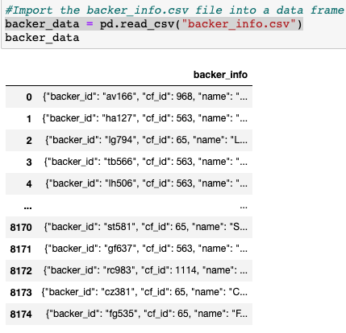
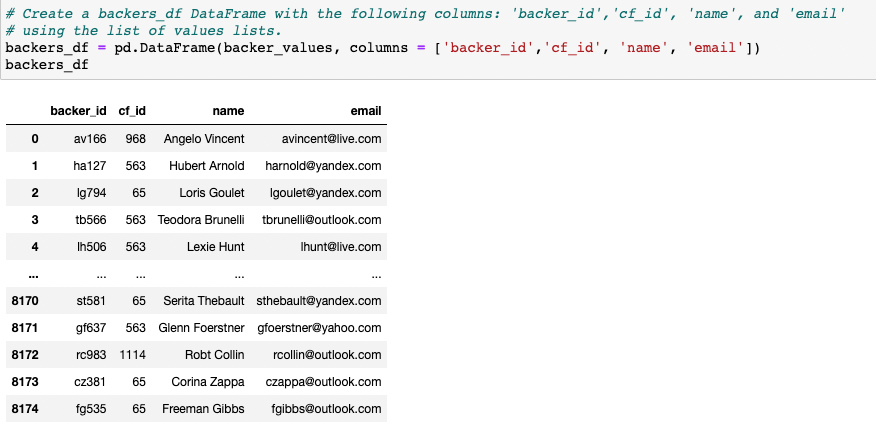
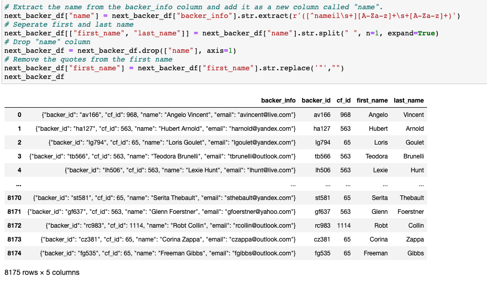
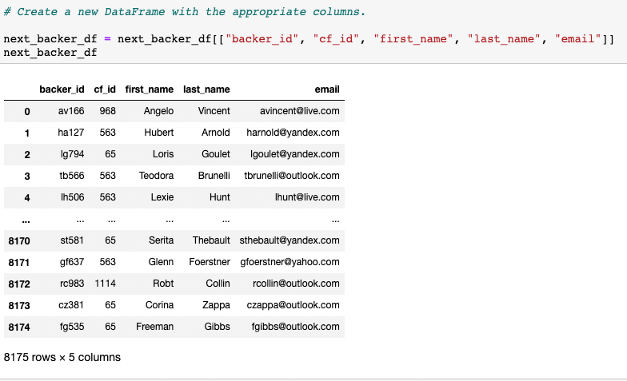
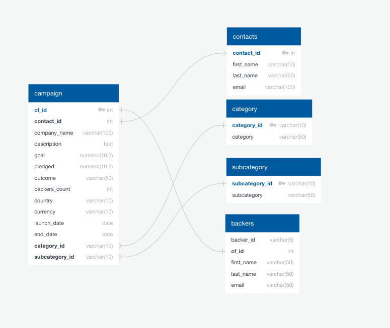
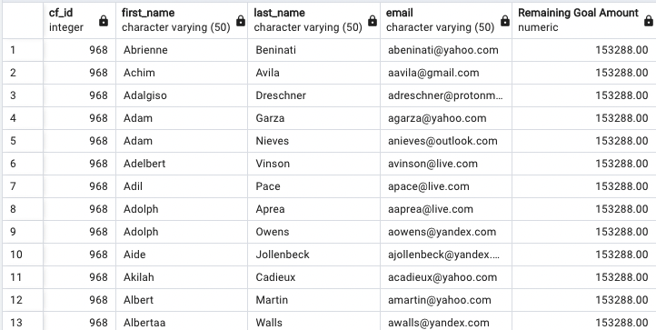
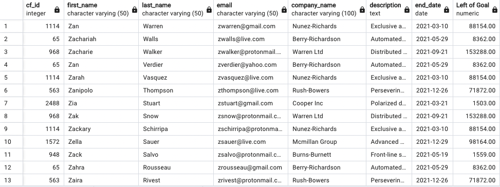

# Crowdfunding ETL
 

Shehryar Siddiqui 
UC Berkley Extension 
August 31, 2022 

 

  

 
## Overview of the Project
 
A crowdfunding platform called "Independent Funding" who focuses on funding independent projects has been growing as of late. Their growth has required massive changes when it comes to accessing their data. Currently, the data is in a large Excel file and they want to move that data onto a PostgreSQL database. In turn, this will assist the analytics team perform analysis and develop reports on behalf of their company's stakeholders. In addition to stakeholders, this will also assist individuals who have donated to projects. To tackle this issue I teamed up with a co-worker named Brita. We recieved an additional objective to use a encorporate a new data set that contains information about backers who pledged at live events. 
 
### Phase One: Extract and Transform the Data
 

  

 
With the help of Python and Pandas. Brita and I were able to extract and transform the ETL data. To start this processs we downloaded the backer_info.csv (contained backer info) and python file called Extract-Transform_starter_code.ipynb (renamed to Extract-Transform_final_code.ipynb. The backer_info.csv was then imported into a DataFrame. According to Stojilkovic (N.D.),"Pandas DataFrames are powerful, user-friendly data structures that you can use to gain deeper insight into your datasets!" To establish our pandas dataframe we inducted the following function: backer_data = pd.read_csv("backer_info.csv"). At this point it was important to analyze our data through pandas .head() function. The benefit of .head() is we can view our data frame and how it is sorted in that moment. Our data frame now has one column ("backer_info") which was full ofwhat could be new columns and their values. So at this point weneeded to get ready to disseminate our data to better tell the story behind the data. 
 

  

Referencing the image above we could now see how the data frame needed some serious work. This is when Python comes into play with its dictionary methods. We first iterated through the backers data frame and then converted each row to a dictionary (backers_values =[]). From this point we iterated through each dictionary (.iterrows():) with the help of list comprehension and json(json.loads()) to obtain the values for each row using list comprehension (backer_row_values = [v for k, v in converted_data.items()]). According to Timmins (N.D.), "One main benefit of using a list comprehension in Python is that it’s a single tool that you can use in many different situations." At this point we had our data frame almost complete, but we needed to extract the list of values. The first thing to do was to extract the string values: "email", "name", "backer_id", and "cf_id". Our first phase of ETL was now complete and we were ready to export the data frame as a csv file (backers_df.csv)
 

  

 
The most challenging part of the entire analysis was about to begin. We now had to trasform and further clean the data. However, the challenge was within Regex. Albeit intimidating, using RegEx was exciting and pivitol to my growth as a Data Scientist. To give a brief explanation of Regex, according to Computer Hope (N.D.), "Short for regular expression, a regex is a string of text that lets you create patterns that help match, locate, and manage text." I read the backer_info.csv file into a new data frame called "next_backer_df." I extracted the alpha-numeric "backer_id" from the backer_info column (next_backer_df["backer_info"].str.extract(r'([a-z]{2}\d{3})')). The next step was to extract the two to four-digit "cf_id" which was completed similarly to the previously used function (backer_id extraction); however,  the Regex code was written as: .str.extract(r'(\b\d+\b)'). The "name" column was next on the list for extraction, but I had to first extract the name column (str.extract(r'([^nameil\s+][A-Za-z]+\s+[A-Za-z]+)') and then split the first and last names in their respective columns (first_name, last_name). I then dropped (df.drop()) the name column, because to have name, first_name, and last_name all as sequential columns didn't make sense. The first and last names generated into the data frame almost perfectly, but the first names had quotation marks before the first name. To drop the quotes I used str.replace('"',"") to achieve a cleaner data frame. The process is still not complete as my next task to help Brita was to add one more column ("email") and create a new data frame without backer_info as a column.
 

  

 
The "email" column is next on the list. The next_backer_df needed it's email column and to do this was very similar to how I extracted previous data. However this time an "@" symbol as well as others was needed to complete the code (.str.extract(r'(\S+@\S+)'). The "\S" symbol matches non-white space characters, which was complemented by the "+" to match characters before itself one or mor times, the "@" symbol tells the system to match that specific symbol, and then I finalized the code with "\S." When think about this code in an abstract way. Just looking at "(\S+@\S+)" makes a bit more sense that it would match email addresses because it looks like an email address. Albeit, the email address column and it's values are now established - matching corresponding data. The email column needed more work to clean up quotation marks and curly bracket symbols around the email addresses (.str.replace('"',""), .str.strip('{}')). Finally, the the columns for the data frame were set in a newly designed data frame and then exported as a csv file (backers_csv).
 

  

 
At this point of the ETL process I will creat an ERD and a table schema to then finally load the data. Using ERD I will create a backers table that will hold the primary and foreign keys based on the information from the backers.csv, campaign.csv, category.csv, subcategory.csv, and the contacts_string_data.csv files. Once this process was completed I then exported the ERD as a csv file and used it in PostgreSQL.
 

  

 
Brita and I are almost finished with our ETL process. We wanted to dig a bit further to understand our data though. I uploaded a new file called "crowdfunding_SQL_Analysis.sql." I first wrotea SQL query to retrieve the number of backer counts in descending order. This was done for each "cf_id" amongst all "live" campaigns. After doing this we then recieved information from Brita's boss who wanted to be able to email every contact from the live campaigns. To better assist Brita's boss I wrote a SQL query that would create a new table "email_contacts_remaining_goal_amount." This table would hold the first/last name of the contacts, their email addresses, and the remaining goal amount. That way Brita's boss could discuss the remaining goal amount to the contacts. To do this I first selected each column we needed to look at (SELECT DISTINCT ba.cf_id, ba.first_name, ba.last_name, ba.email,(ca.goal - ca.pledged) AS "Remaining Goal Amount""). Then used the INTO function to create the new table (INTO email_contacts_remaining_goal_amount). Using FROM as a base function to gather data from the backers table I then used JOIN to allow the campaign table to merge with the backers table into the new table we were creating. I then used WHERE to collect "live" from the "outcome" column in the campaign table. Finally the table was ordered by "Remaining Goal Amount" in descending order. 
 

  

 
As the ETL process was considered as complete. Brita and I recieved a new request from her boss. They had a good idea to send emails to the backers to let them know how much of the goal remained for the live campaigns. So I took the email_contacts_remaining_goal_amount table and began to work on a new table called "email_backers_remaining_goal_amount." The code to complete this was almost identical to the query I wrote for the email_contacts_remaining_goal_amount table. However, now I adjusted the AS function in the SELECT query to "Left of Goal." I also added ca.company_name, ca.description, ca.end_date to the SELECT query. The order by column was based as "ba.email DESC;"
 

  

 

References:
 
Stojiljković, M. (N.D.). Real Python. The Pandas DataFrame: Make Working With Data Delightful.https://realpython.com/pandas-dataframe/ 
Timmins, J. (N.D.). Real Python. When to Use a List Comprehension in Python. https://realpython.com/list-comprehension-python/#:~:text=One%20main%20benefit%20of%20using,different%20approach%20for%20each%20scenario.
Computer Hope. (N.D.). Regex. https://www.computerhope.com/jargon/r/regex.htm

